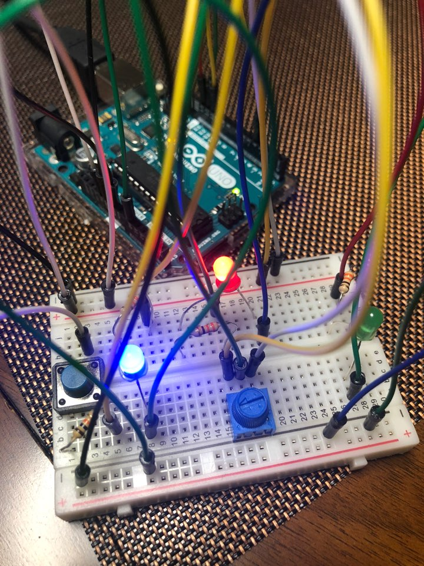
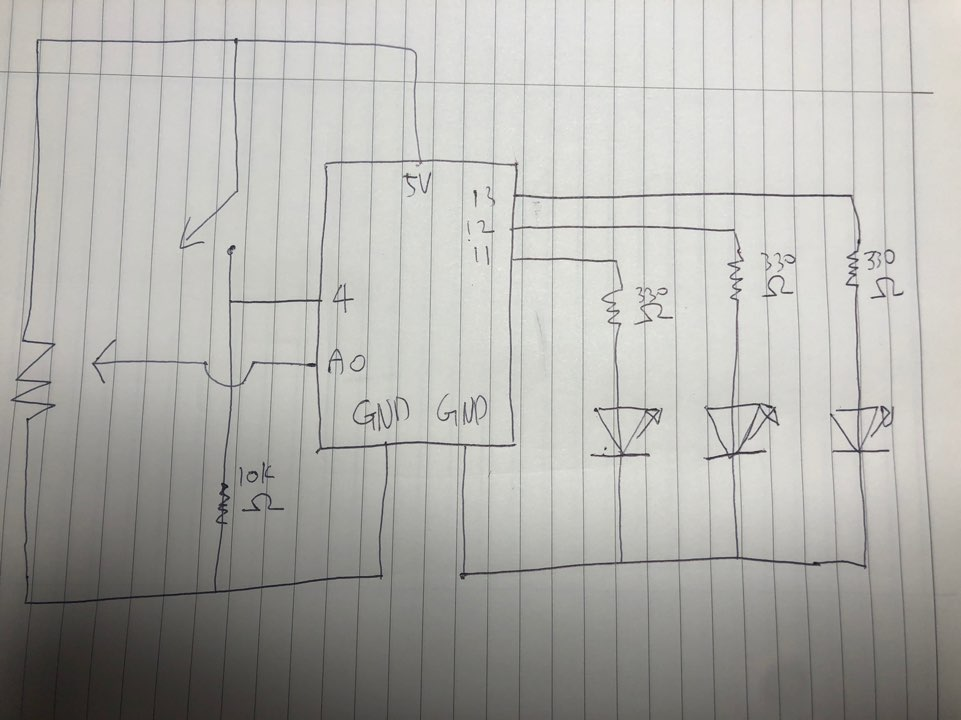

# Navigator
## Overall Concept
I have decided to make a little compass, which isn't actually a compass but somewhat similar to it. With the potentiometer, I let three LEDs light up according to the way potentiometer is pointing.
Since we also have to use buttons, I decided to program it where it works properly when the button is pressed. While the button is not pressed, the LEDs that are not on the position of where the potentiometer is pointing will light up, leading to a wrongly activated navigator.

## Schematic

## Result
[Click to watch me play.](https://youtu.be/UuS4i0LGSjE)

## Problems Faced
I did not face any big problems during this project.
