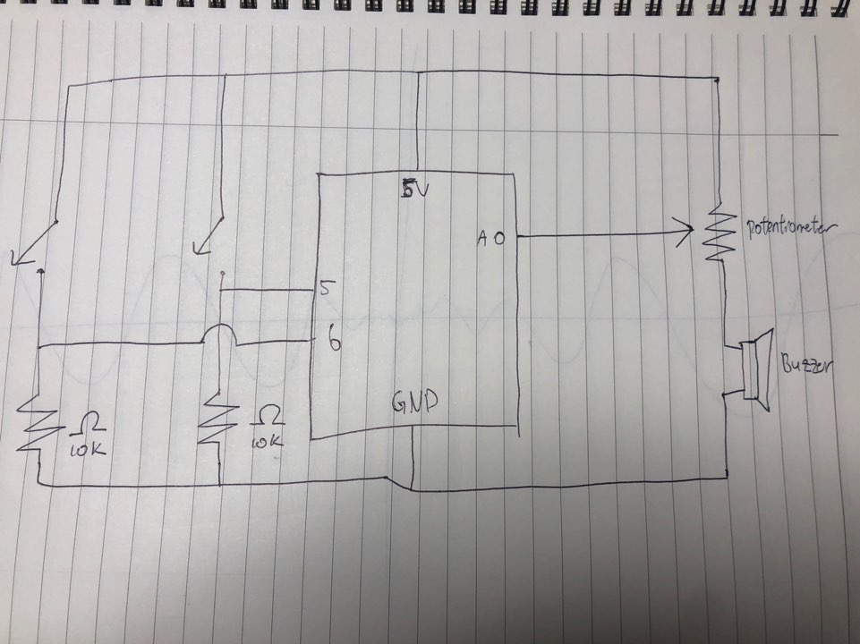
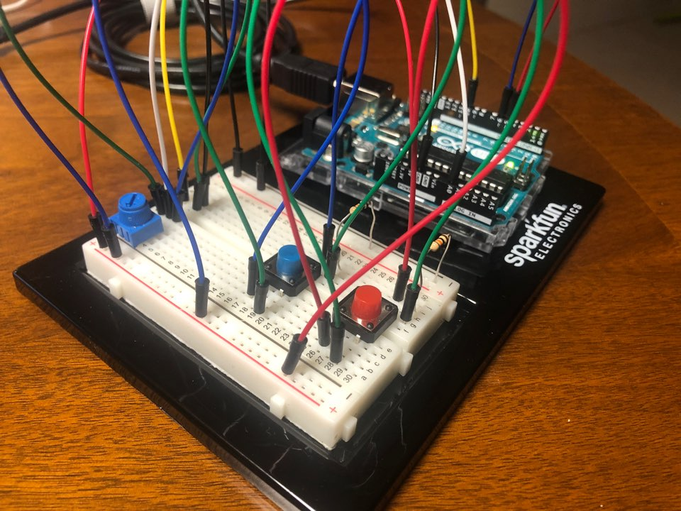

# Musical Instrument
## Overall Concept
From the moment we learned how to use buzzers during class, I thought that making a launch pad would be fun. Although it would be hard to make a launch pad with the given materials, I decided to make a mini launch pad for this project. I set up two buttons, where one button makes a lower note and the other makes a higher note. For example, if the button 1 makes a sound of note c on the fourth octave, button 2 will make a sound of note c on the fifth octave. To make it more fun, I set up a potentiometer where depending on how much it is turned, the note will change. Dividing the angle to three, the first third will have a note of c, second third will have have a note of d, and the last third will be note of e.

## Schematic

## Result

([Click to watch me play.](https://youtu.be/UuS4i0LGSjE))

## Problems Faced
I lost my piezo buzzer when i visited my grandparent's house so i wasn't able to check if either my code or the board works. Fortunately I was able to buy one in Korea via online and it is arriving 11/18 (tomorrow), so I will be uploading my assignment after it is delivered.
The photo below is in Korean, but its a reciept!

## References
https://www.arduino.cc/en/Tutorial/BuiltInExamples/toneMelody
