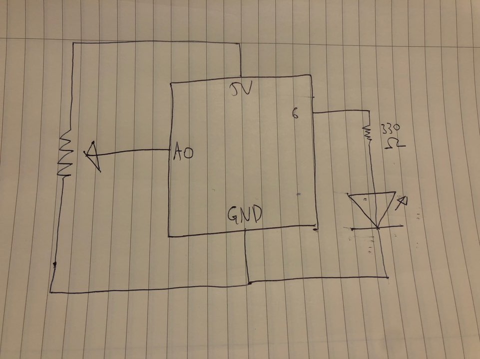
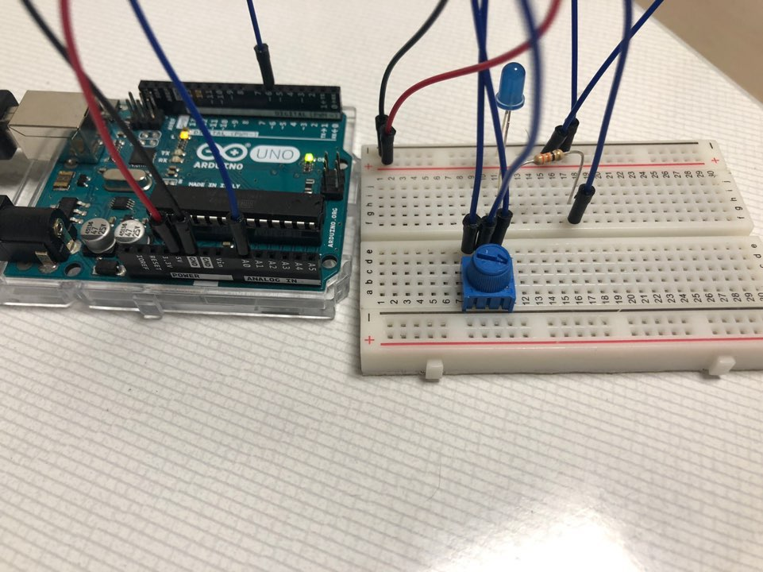

# Mini Game
## Overall Concept
After getting permission to use codes for a mini game coded by Joseph, I decided to use buttons from arduino and LEDs to show certain states of the game instead of mouse clicking. Joseph's mini game was shooting bubbles in the direction the mouse cursor is located at, and eliminating the bubbles on the top via matching the colors. I thought that the button could be clicked instead of mouse being clicked when the bubble is shot. However, I was unable to make the button work with processing, and had to change the plan. I set the code to blast a bubble only when the potentiometer is at a certain value, and while the mouse is clicked. This worked. I also understood Joseph's gae shows an interface of 'Game Over' when the player is out of turns. If so, I set the LED to turn off, and while the game is on, to turn it on. I wasn't able to recreate Joseph's mini game efficiently due to being unable to use buttons instead of mouse clicking.

## Schematic

## Result
 
([Click to watch me play.](https://youtu.be/iymA2m_SmtY))

## Problems Faced
I am not sure how to get a value from arduino and send it to processing yet. It is confusing... If i knew how it worked, the game must have be recreated efficiently.

## References
https://github.com/jhongover9000/intro2im/blob/master/September29/IM_Assignment3v2.pde
