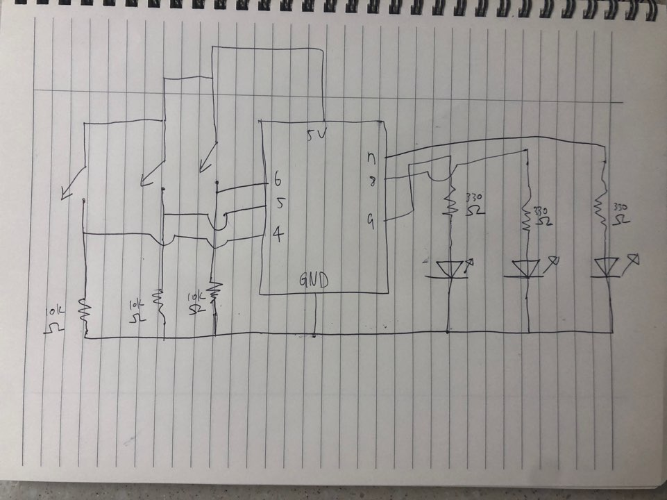

# Play with LEDs
## Overall Concept
As soon as I saw the topic for this project "create a puzzle that can be solved by pressing the buttons," I thought of a game where each buttons turn on and off different LEDs which makes the user hard to make all three LEDs light up.
So what I thought at first was to make two buttons(1' and 2') light up a same LED(1) while the other button(3') lights up the other(2). The other LED(3) will be turned on from the start. This would make the player think that either button 1' or 2' pressed with button 3' will turn all the lights up. Here I decided to twist the game a little bit to make it harder. I made LED 3 to turn off when button 1' and 3' is pressed. This will make the player confused because they must have expect all the LEDs to turn on. This will lead the player to try buttons 2' and 3' where they will finally get all LEDs lit up.

## Schematic

## Result

## Problems Faced
I had a hard time pluggin in the switches... I was worried that the copper part might break and it actually took a while for me to safely plug in all three of them.
Also, it was a challenge for me to make the board look clean. I tried to make it as clean as possible so that the player can easily press the buttons, and to easily draw the schematic.
Now at the moment of writing the README.md, my mp4 video doesn't play for some reason.
