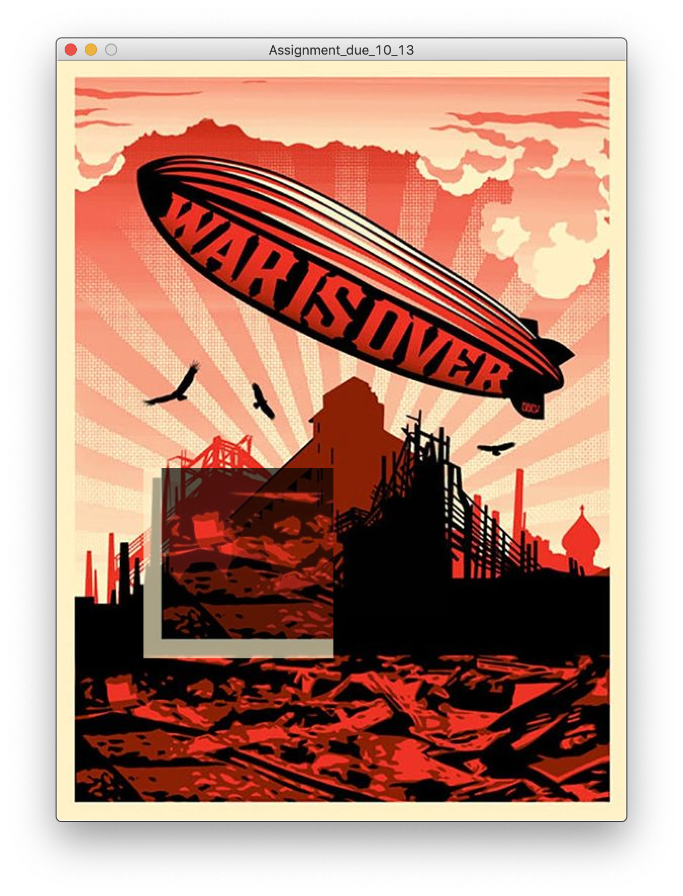
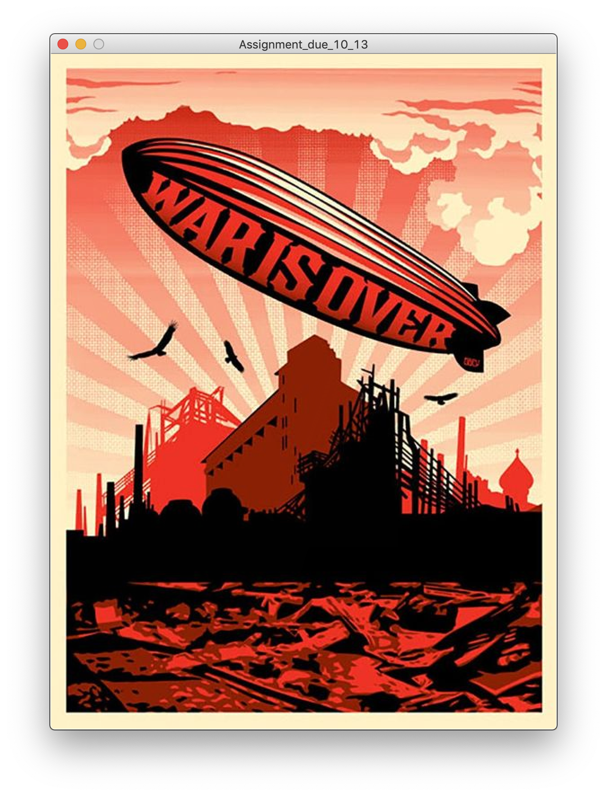

# Image Manipulation
## Overall Concept
With an image on the background, when mouse clicked, randomly choose a piece of the image(which is transparent), and when mouse pressed, hold the randomly chosen piece of the image. Inspired by puzzles, where we match the piece of an image to its place.
#Final

## Dificulties
Finding the equation that is used for saving pieces in the PImage array.
Since I needed a correct equation that increments by 1 via using the two variables of the two nested loops, it caused me some time figuring it out how.
But eventually, with trials and errors, I was able to figure it out.
## Anything Clever
Nope! Nothing much I guess!
