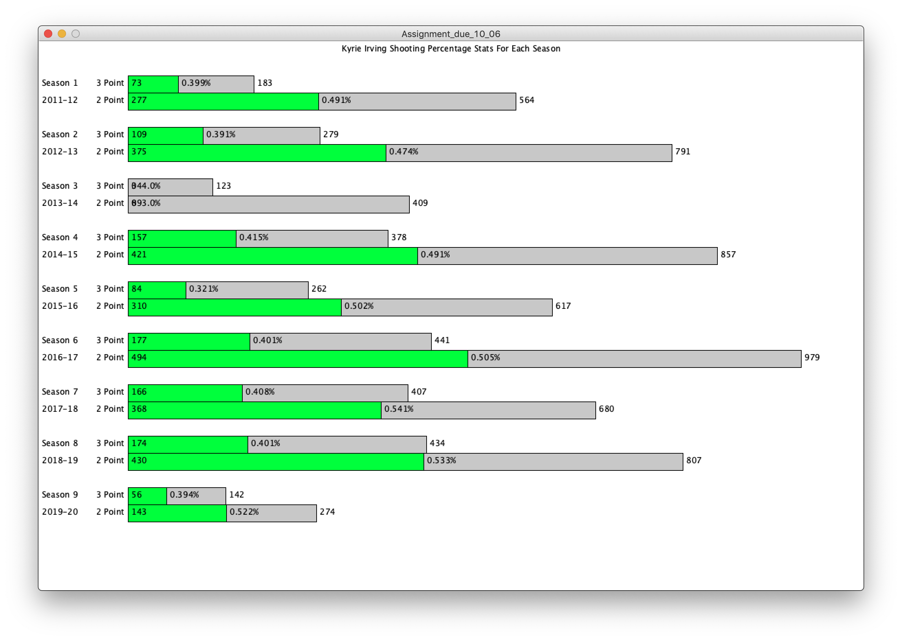
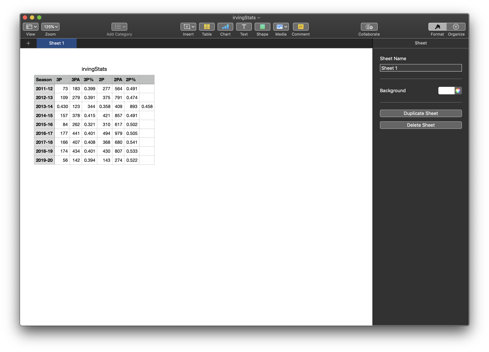
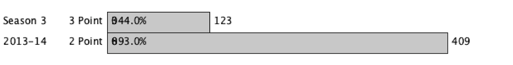

# Creating a data visualization or a generative text
## Overall Concept
A data visualization for two point shoots and three point shoots made, attempted, and the percentage for making shoots based on Kyrie Irving's each season played.

## Process
After getting data from the .csv file, save it into different lists, one for the header, one for the number of shots made and attempted(int), and one for the percentage of shots created(float).
Draw one of Kyrie Irving's season including 3 point shots made, attempted, and the percentage of shots made. Then same for the 2 point shootings.
Put all in a for loop, until all of the seasons are drawn.

## Results

## Problems Faced
I have not been able to figure out how to change the data sheet into a .csv file, and therefore during the private meeting, Prof. Shiloh had made my data sheet into a data file. However, I have sent the data sheet that had a flaw in season 3, 2013-14. Without knowing how to convert the sheets into a .csv file, I have completed my program working well, except for one logic error, where the season 3 is drawing based on a wrong data since the .csv file needs to be fixed.

The problem with my .csv file

The outcome due to my error in .csv file

## References
The data source for my .csv file is from [this website](https://www.basketball-reference.com/players/i/irvinky01.html).
Another reference for spliting lists after getting a data from .csv file was from [Prof.Aaron Sherwood's Github repository](https://github.com/aaronsherwood/introduction_interactive_media/blob/master/processingExamples/textExamples/splitCommas/splitCommas.pde)
