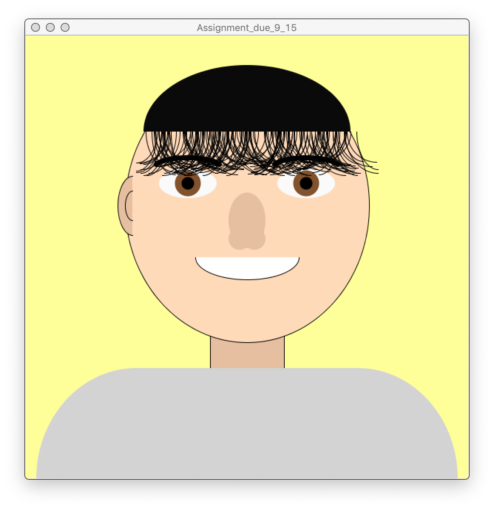

# Self Portrait Assignment

I had a hard time making a natural looking hair. For natural hair, I thought that a finite loop that will make adequate amount of random arcs would help. Therefore i used 'for' and 'if' loops. I've set the loop to go on until there are 200 arcs(or hairs) made. I incremented the value of i by 1 every time one hair was placed so that the loop is able to count the number of hairs placed. When 500 randomly placed hairs are made, I made the program to stop using 'else' so it would not process further and make more hair. But it turned out to be less natural than expected so I'm sad.
