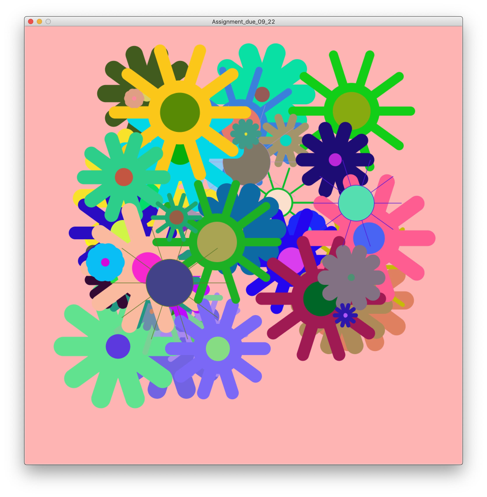

# Simple Art Work Assignment

I had a hard time figuring out how to make the pedals. Since drawing a trapezoid shaped pedal with round edges was beyond my skill, I decided to use lines with thick strokes. It was easy to make a single pedal, but multiple ones with a sharing center was hard for me to figure it out. Then, since I was using the for loop to make multiple pedals, i've got an idea to rotate the pedals using the incrementing variable and degrees. Since i thought 10 pedals would be the best fit, and easy to calculate, I multiplied 36 for each second coordinate in the line function.
