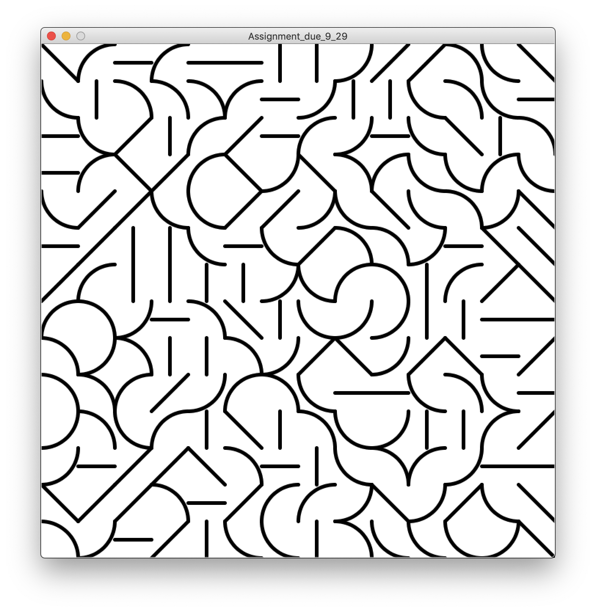
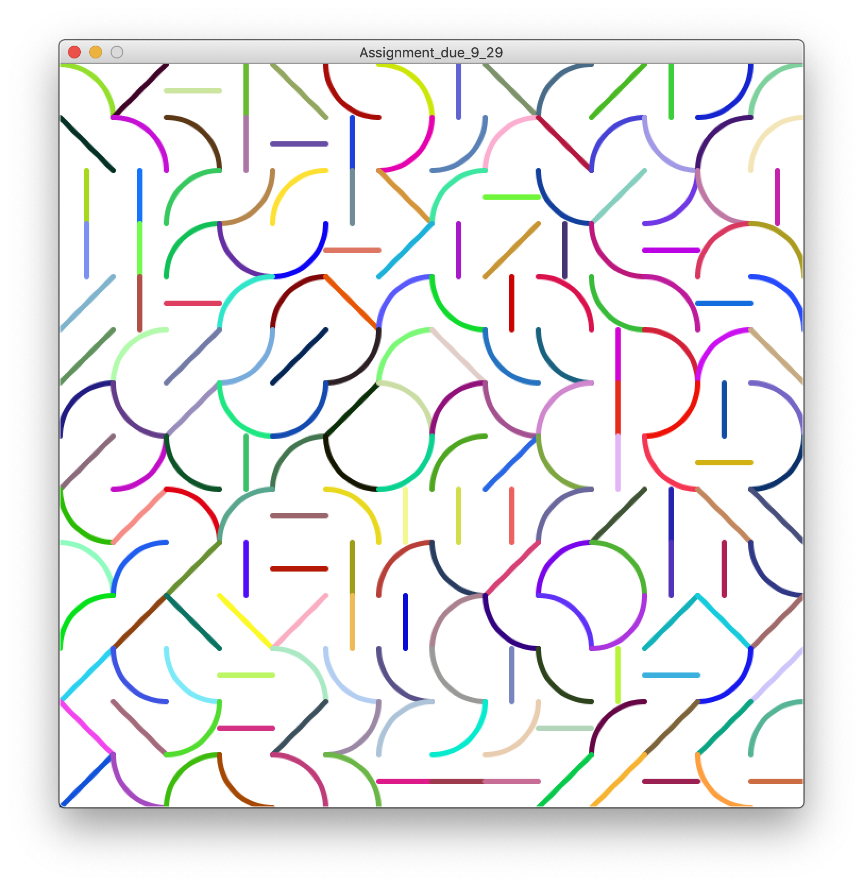

# Art Work - OOP

Inspired by our class' last week reading assignment, Casey Rea, I was able to come with an idea similar to his work.
He has made numerous projects where identical areas constantly spread through out the given space hold different single-srtoked patterns. And I personally thought it was a crazy idea to make an artwork with random patterns stretched on the whole pallete. So I made an artwork similar to his, where total of six random patterns are randomly printed for each systematically divided area. I have made different versions (different colors) for my artwork to give more complexity. Ver.1 is for black strokes, Ver.3 for totally random colors, and Ver.3 for Mondrian's colors.

I had a hard time figuring out how to make the patterns through out the pallete with constant space. Since I had to set patterns for each splitted area, I struggled how to translate each pattern within the loop. I was able to resolve the problem via using for loops, rather than while loops. Since for loops let me increment a variable used in the loop, I was able to come with a formula that can translate each pattern made. I multiplied the space between each pattern's starting point with the x coordinate for horizontal patterns, and with y coordinate for vertical patterns.

I think I was clever to make the art with into three versions. One with simple black strokes, one with random colors, and one with Mondrian's colors (also known as primary colors). I personally liked the patterns with Mondrain's color the most!
