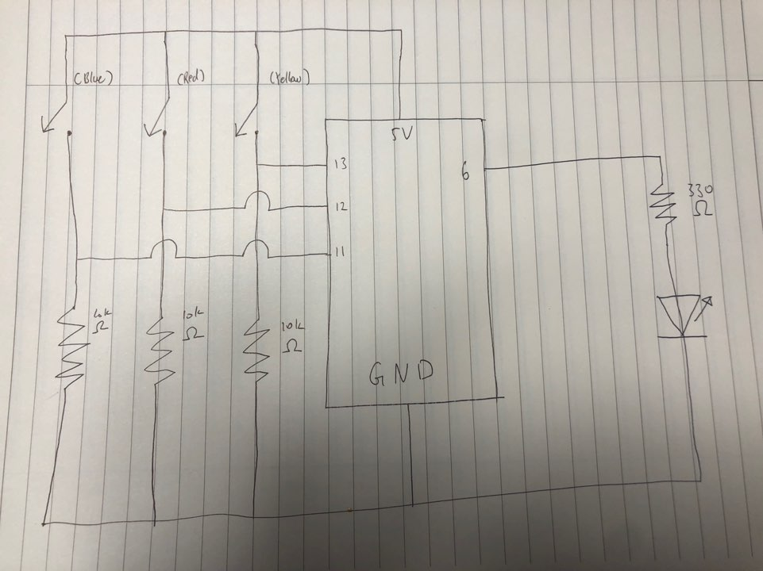
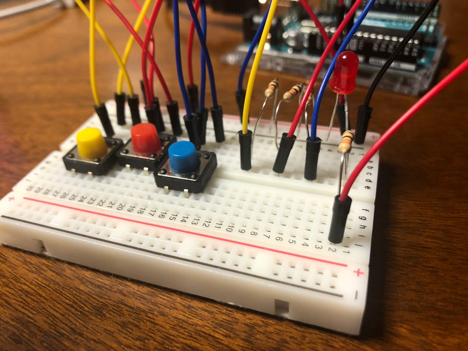
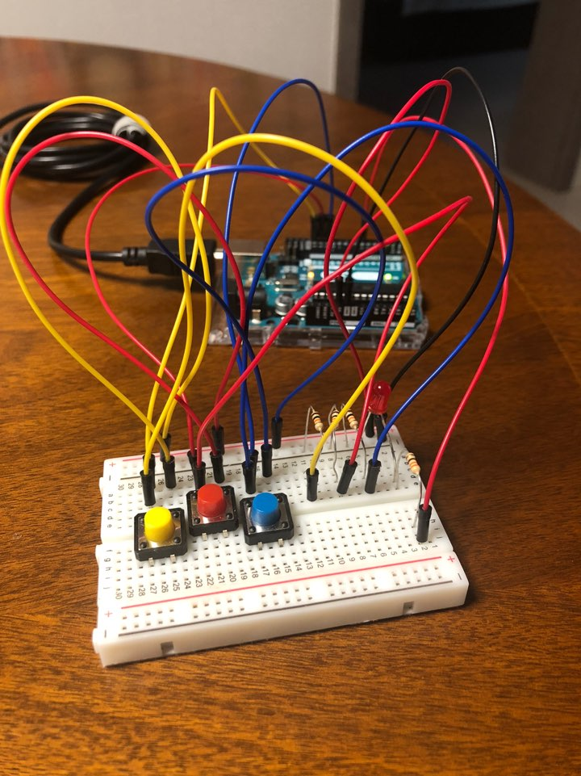

# Final Project - Grow A Plant

## The Plan I Had Before
During the class on the day we were announce our final project theme and idea, I presented a mini game similar to ttthe movie maze runner where the player is unable to see the whole map, and monsters are generated during the game. I wanted a game with two simple buttons where one meant attack and the other defend. Sounds like a very fun game, but it came to an end when I noticed that making a random maze, lettting the user see only the path he/she went through would take too much time for me. So I came up with another idea - growing a plant.

## Concept
The idea of growing a plant came from me after watching my mom getting obsessed with growing a plant. After getting this idea, I thought of how to make a game where processing and arduino can communicate. I decided to use three buttons, where one brought up sunlight, one made it rain, and the other killed a bug. And yes, there will be bugs generated while the player plays the game.

So, the over all concept of the game is simple - you just have to let it rain and also give the plant sun light to make it grow faster. But also kill the bugs because they will decrease the growth rate of the plant and later on even kill it. When a bug exists, the LED light will light up so the users can catch the bug easily.

There is no winning in this game. It is an endless game where the user can grow a plant up until it has 1000 leaves (which is very unlikely to happen). On the other hand, if the plant dies due to bugs eating off the leaves, the game will end.

## Schematic

## The Result

[This is a video of me playing the game.](https://youtu.be/6S4vNLqhVjU)
[This is a video of how the game processes with no control by the user.](https://youtu.be/UBSG5LHPg1Q)

## Problems
