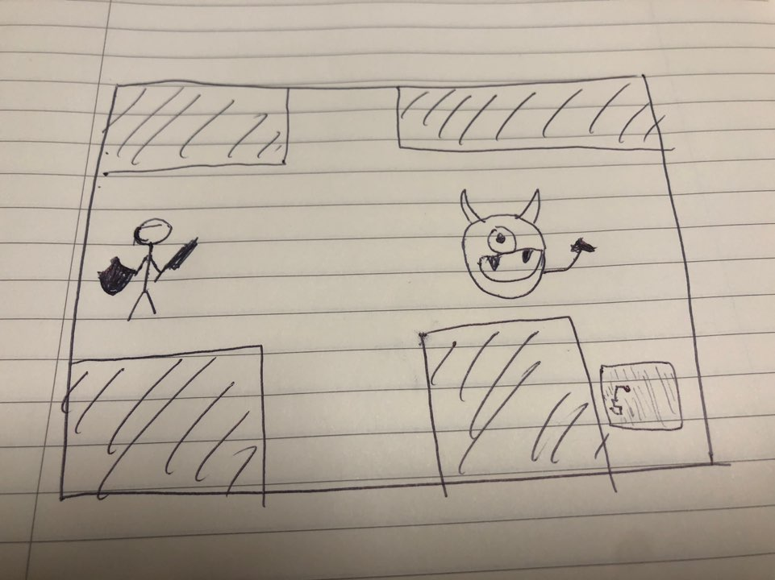

# Final Project - Maze Runner - Journal

[Day 1](journal.md#day-1)

## Concept
Inspired from the movie "maze runner", I thought I could make a mini game related to the topic. There will be a total of 10 stages, where the user is able to control the player in the game to move up, down, right and left with the arrow keyboards. The untimate goal of this game is for the player to cross the map (which will be a maze) to the finish line with out getting killed by monsters. There will be three different types of monsters (I haven't thought of any yet), and as the stages passes by, there will be faster, stronger and more monsters on the map. While the player plays the game, the player is unable to see the whole map, because his vision is not onmiscient. However, the player will be able to remember the paths he came through, and the mini map will reveal the position of the player on the whole map as well as the paths he came so far.

## Rough Sketch of the Game Interfacce

#### Day 1 (11/27)
