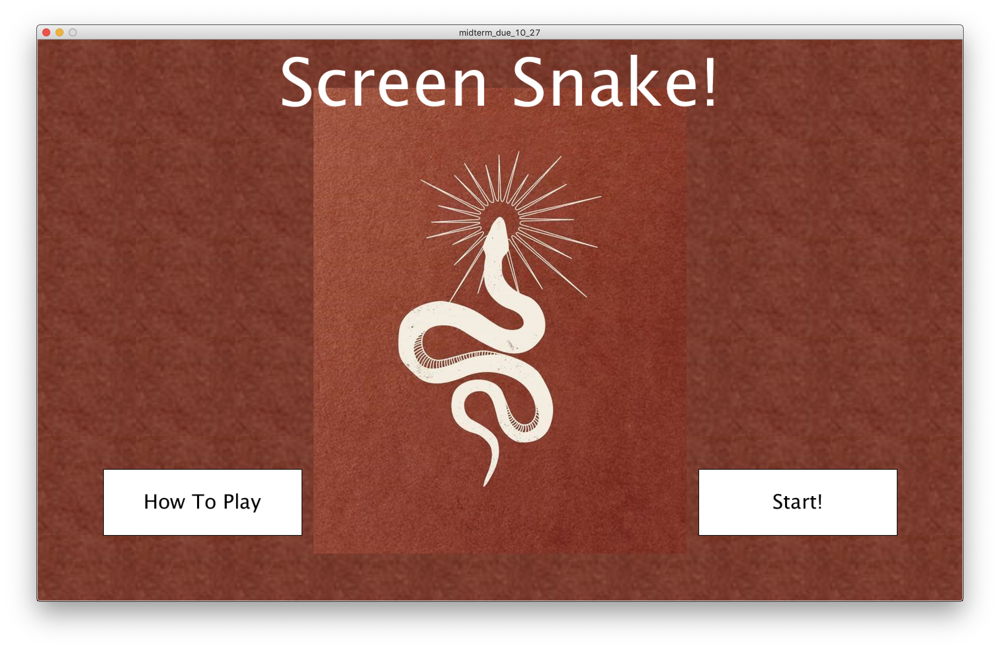
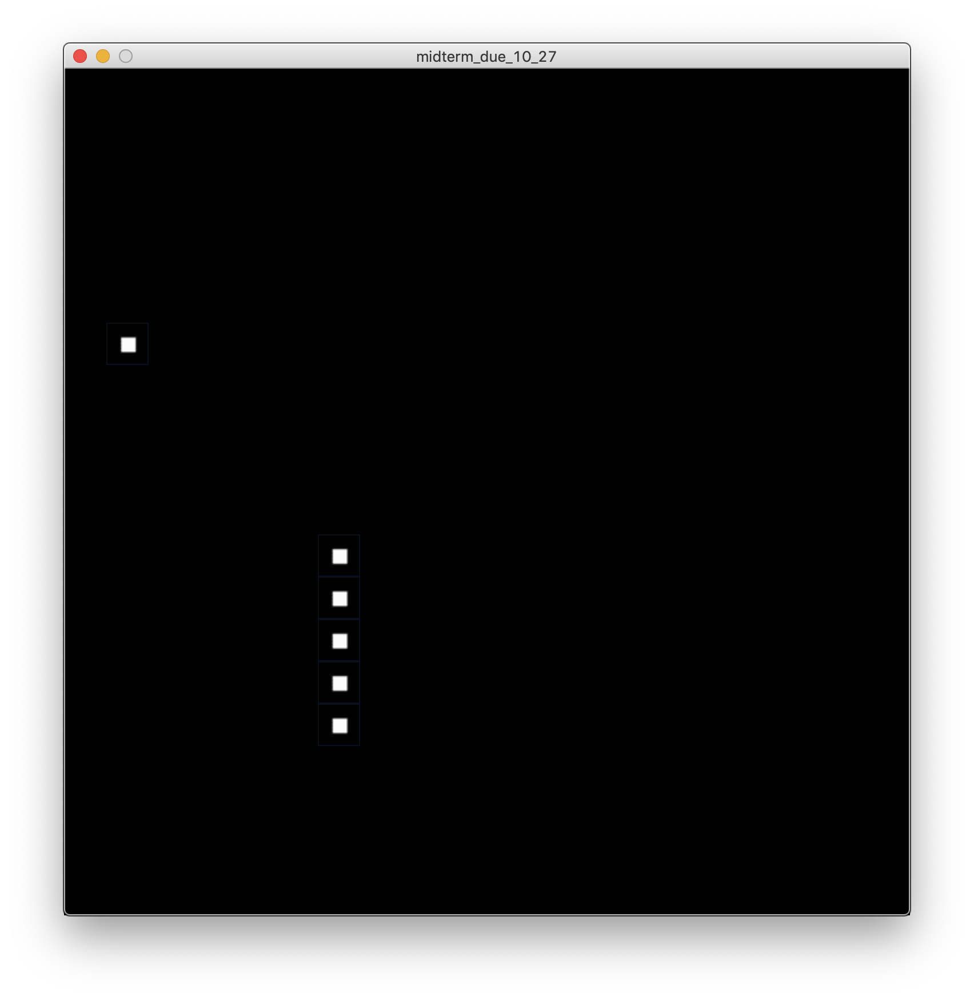

# Midterm: Make A Game (Screen Snake)
## Overall Concept
Screen snake is a single player game where the player uses the direction keys on the key board to move the snake on the screen. There will be randomly generated pieces of the snake's body on the screen, and when the snake eats the piece, the snake gets longer and another piece of the body will be generated randomly.

## Final
### Starting Page(When program is run)

### Instruction Page(When "How To Play" Button is pressed)

### Game Played(When "Start" button is pressed)

### End Page(When user's snake is dead)

## Difficulties
I have fronted a lot of difficulties througout coding this game. One of two main problems where how to or even if I should user object oriented programming for a much organized, and concise coding. The other problem was using the time frame.
1. Since i'm new to computer science, I had no clue on what oop was. While coding to make the snake expand it's body, I thought that my coding began to get a little messy and believed that there would be a better way to code. At the time I was using only functions, if statements, and loops, which restricted me from programming concise codes. I've have asked one of my friends who is also an upperclassmen at NYUAD, and he told me I could use object oriented programming. I had to learn what that was, and my friend (in a way) tutored me the basic knowledge and usage of it with good grace.
2. Since screen snake is a game that requires a time frame where the snake moves according to time, I first thought of using frameRate. However, it turned out that the frameRate function forces processing to slow down, and changes the normal fps form 60 to something else. This function also makes the user harder to check if the key was pressed because the behavior will act every second. So if I used frameRate(1), the user has to press the key board for a full 1 second to get the keyboard input. Instead, I made a variable 'time' to control the time frame. With the equation "time = ++time % ((60/fps)+1)" in the draw function, I am able to make the time increase, but will be in a loop since the modulus will be the remainder(between 0 and the biggest remainder) and reset to 0 once in a while. with the if statement after that "if (time == (60/fps))", the whole game will be updated every time the variable 'time' is equal to 60/fps. In my case, the fps was 10, so in every 10 ticks, the game will update, and able to move the snake with the direction key pressed once.

## What Could Have Been Done
1. I could have included two more functions to make the game loop more advanced. I could have let the user choose the difficulty of the game(which is the speed of the snake), and change the fps rate according to what the user chooses. Easy could be 5 fps, medium as 10, and hard as 20.
2. Another thing was that my game screen was a little bit boring. I could have made the background more interesting via using fill(), and check if the user pressed the space bar to change the background to a random color everytime the key is pressed.
